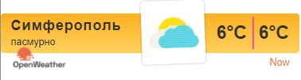
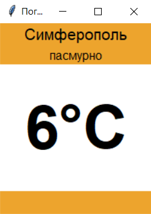

<p align="center">МИНИСТЕРСТВО НАУКИ  И ВЫСШЕГО ОБРАЗОВАНИЯ РОССИЙСКОЙ ФЕДЕРАЦИИ<br>
Федеральное государственное автономное образовательное учреждение высшего образования<br>
"КРЫМСКИЙ ФЕДЕРАЛЬНЫЙ УНИВЕРСИТЕТ им. В. И. ВЕРНАДСКОГО"<br>
ФИЗИКО-ТЕХНИЧЕСКИЙ ИНСТИТУТ<br>
Кафедра компьютерной инженерии и моделирования</p>
<br>
<h3 align="center">Отчёт по лабораторной работе № 1<br> по дисциплине "Программирование"</h3>

<br><br>

<p>студентки 1 курса группы ПИ-б-о-201(2)<br>
Коротеевой Кристины Александровны<br>
направления подготовки 09.03.04 "Программная инженерия"</p>


<br><br>
<table>
<tr><td>Научный руководитель<br> старший преподаватель кафедры<br> компьютерной инженерии и моделирования</td>
<td>(Оценка)</td>
<td>Чабанов В.В.</td>
</tr>
</table>
<br><br>

<p align="center">Симферополь, 2020</p>
<hr>

## Цели работы
* Закрепить навыки разработки многофайловыx приложений;
* Изучить способы работы с API web-сервиса;
* Изучить процесс сериализации/десериализации данных в/из json;
* Получить базовое представление о сетевом взаимодействии приложений;

## Постановка задачи
Разработать сервис предоставляющий данные о погоде в городе Симферополе на момент запроса.  В качестве источника данных о погоде используйте: http://openweathermap.org/. В состав сервиса входит: серверное приложение на языке С++ и клиентское приложение на языке Python.

Серверное приложение (далее Сервер) предназначенное для обслуживания клиентских приложений и минимизации количества запросов к сервису openweathermap.org. Сервер должен обеспечивать возможность получения данных в формате JSON и виде html виджета (для вставки виджета на страницу будет использоваться iframe).

Клиентское приложение должно иметь графический интерфейс отображающий сведения о погоде и возможность обновления данных по требованию пользователя.

Подробности указаны далее.

## Выполнение работы
#### Получение API и создание запросов
1. Регистрируемся на openweathermap.org и получаем личный api-ключ. Полученный мною ключ выглядит следующим образом: ```7c07aa2d844b83b4dc811d5a8663ac39```
2. Составляем запрос на получение прогноза погоды для Симферополя с почасовым интервалом, в градусах Цельсия, на русском языке (пункт 1.7). Составленный мною запрос: ```http://api.openweathermap.org/data/2.5/onecall?lat=44.957191&lon=34.11079&exclude=daily,minutely,current&units=metric&lang=ru&appid=7c07aa2d844b83b4dc811d5a8663ac39```. Данный запрос предоставляет нам прогноз погоды с указанными параметрами в формате json.
3. Составляем запрос на сайт worldtimeapi.org для получения времени в Симферополе (пункт II). Составленный мною запрос: ```http://worldtimeapi.org/api/timezone/Europe/Simferopol```. Данный запрос также представляет информацию по запросу в формате json.

#### Создание серверного приложения
Переходим непосредственно к созданию серверного приложения, оно будет создаваться на языке С++. Сервер должен запускаться и слушать get запросы приходящие на 3000 порт localhost. Если приходит запрос на "/", сервер формирует и отправляет html-виджет с погодой. Если приходит запрос на "/raw", сервер формирует и отправляет json с температурой и описанием погоды. При первом запуске, данные о погоде сервер получает с openweathermap.org записывает в пременную (кэш) откуда и "достаёт" их при каждом пользовательском запросе. Время данных о погоде в кэше сравниваются с текущим временем, полученным с помощью запроса на worldtimeapi.org. Кэш обновляется, если данные устаревают. Полный исходный код сервера: 
<details>
<summary>Код сервера</summary>

```С++

#include <iostream>
#include <fstream>
#include <string>
#include <cpp_httplib/httplib.h>
#include <nlohmann/json.hpp>

using namespace std;
using namespace httplib;
using json = nlohmann::json;

int hour;

string getCurrentWeather() {
    string s_weather;
    Client GetWeather("http://api.openweathermap.org");
    auto res = GetWeather.Get("/data/2.5/onecall?lat=44.957191&lon=34.11079&exclude=daily,minutely,current&units=metric&lang=ru&appid=7c07aa2d844b83b4dc811d5a8663ac39");
    if (!res) {
        cout << "Can't get weather info.\n";
    }
    else {
        s_weather = res->body;
        cout << "Weather info was recieved.\n";
    }
    return s_weather;
}

string getCurrentTime() {
    string s_time;
    Client GetTime("http://worldtimeapi.org");
    auto res = GetTime.Get("/api/timezone/Europe/Simferopol");
    if (res->status == 200) {
        s_time = res->body;
        cout << "Time was recieved.\n";
    } 
    else {
        cout << "Can't get time.\n";
    }
    return s_time;
}

json j_weather, j_time;
string widget_template;
void gen_responce(const Request& req, Response& res) {
    if (j_weather.empty()) {
        j_weather = json::parse(getCurrentWeather());
    }
    j_time = json::parse(getCurrentTime());
    for (int i = 0; i < 48; i++) {
        if (j_time["unixtime"] < j_weather["hourly"][i]["dt"]) {
            hour = i;
            break;
        }
    }

    if (j_time["unixtime"] < j_weather["hourly"][hour]["dt"]){ 
        string temp1 = "{hourly[i].weather[0].description}";
        string temp2 = "{hourly[i].weather[0].icon}";
        string temp3 = "{hourly[i].temp}";
        
        string description = j_weather["hourly"][0]["weather"][0]["description"];
        string icon = j_weather["hourly"][0]["weather"][0]["icon"];
        double temp_value = j_weather["hourly"][hour]["temp"];
        string str_temp_value = to_string(int(round(temp_value)));

        ifstream t_file("template_file.html");
        if (t_file.is_open()) {
            getline(t_file, widget_template, '\0');
        }
        else {
            cout << "Can`t open template.\n";
        }

        widget_template.replace(widget_template.find(temp1), temp1.length(), description);
        widget_template.replace(widget_template.find(temp2), temp2.length(), icon);
        widget_template.replace(widget_template.find(temp3), temp3.length(), str_temp_value);
        widget_template.replace(widget_template.find(temp3), temp3.length(), str_temp_value);
        cout << "Widget strings have been updated.\n";
        
    }
    else {
        j_weather = json::parse(getCurrentWeather());

        string temp1 = "{hourly[i].weather[0].description}";
        string temp2 = "{hourly[i].weather[0].icon}";
        string temp3 = "{hourly[i].temp}";

        string description = j_weather["hourly"][0]["weather"][0]["description"];
        string icon = j_weather["hourly"][0]["weather"][0]["icon"];
        double temp_value = j_weather["hourly"][hour]["temp"];
        string str_temp_value = to_string(int(round(temp_value)));

        ifstream t_file("template_file.html");
        if (t_file.is_open()) {
            getline(t_file, widget_template, '\0');
        }
        else {
            cout << "Can`t open template.\n";
        }

        widget_template.replace(widget_template.find(temp1), temp1.length(), description);
        widget_template.replace(widget_template.find(temp2), temp2.length(), icon);
        widget_template.replace(widget_template.find(temp3), temp3.length(), str_temp_value);
        widget_template.replace(widget_template.find(temp3), temp3.length(), str_temp_value);
        cout << "Widget strings have been updated.\n";
    }
    res.set_content(widget_template, "text/html");
}

json raw;
void gen_raw_responce(const Request& req, Response& res) {
    if (j_weather.empty()) {
        j_weather = json::parse(getCurrentWeather());
    }
    j_time = json::parse(getCurrentTime());
    for (int i = 0; i < 48; i++) {
        if (j_time["unixtime"] < j_weather["hourly"][i]["dt"]) {
            hour = i;
            break;
        }
    }

    if (j_time["unixtime"] < j_weather["hourly"][hour]["dt"]) { //значит в кэше есть этот час
        double temp_value = j_weather["hourly"][hour]["temp"];
        int int_temp_value = round(temp_value);
        string description = j_weather["hourly"][hour]["weather"][0]["description"];
        raw["temp"] = int_temp_value;
        raw["description"] = description;
        cout <<"Raw strings have been updated.\n";
    }
    else {
        j_weather = json::parse(getCurrentWeather());
        double temp_value = j_weather["hourly"][hour]["temp"];
        int int_temp_value = round(temp_value);
        string description = j_weather["hourly"][hour]["weather"][0]["description"];
        raw["temp"] = int_temp_value;
        raw["description"] = description;
        cout << "Raw strings have been updated.\n";
    }
    res.set_content(raw.dump(), "text/json");
}

int main() {
    Server weather;
    weather.Get("/", gen_responce);
    weather.Get("/raw", gen_raw_responce);
    cout << "Start server...OK\n";
    weather.listen("localhost", 3000);
}
```
</details>
<br>

#### Создание клиентского приложения
Создаём клиентское приложение, которое будет посылать запросы "/raw" на 3000 порт localhost. Приложение создаётся на python с использованием библиотеки tkinter. Полный исходный код клиентского приложения:
<details>
<summary>Код клиента</summary>

```python
from tkinter import *
import json
import requests

def site(event = None):
	try:
		load = requests.get('http://localhost:3000/raw').content.decode("utf8")
		data = json.loads(load)

		description.config(text = str(data["description"]))
		temperature.config(text = str(round(data["temp"])) + "°C")
	except requests.exceptions.ConnectionError:
		pass

root = Tk()
root.title("Погода")
root.pack_propagate(0)
root.bind("<Button-1>", site)
root.geometry("200x250")

color = "#eda42d"
w = 100
h = 30

top_frame = Frame(root, bg = color, width = w, height = h)
main_frame = Frame(root, bg = "white",  width = w, height = w)
down_frame = Frame(root, bg = color, width = w, height = h)

top_frame.pack(side = TOP, fill = X)
main_frame.pack(expand = True, fill = BOTH)
down_frame.pack(side = BOTTOM, fill = X)


city = Label(top_frame, font = ("Helvetica", 16), text = "Симферополь", bg = color)
temperature = Label(main_frame, font=("Helvetica", 60, 'bold'), bg = "white")
description = Label(top_frame, font=("Helvetica", 12), bg = color)

city.pack(pady = 0)
temperature.pack(expand = True)
description.pack(pady = 0)

site()

root.mainloop()
```
</details>
<br>

#### Внешний вид HTML-виджета и python-приложения

После запуска серверного приложения в ответ на запрос "/" на порт 3000 localhost в браузере приходит виджет с текущей погодой в Симферополе:



*Рисунок 1. Виджет погоды в браузере*

После этого запускаем и клиентское приложение. Открывается окно, дублирующее информацию из виджета браузера. Окно "Погода" клиентского приложения выглядит следующим образом:



*Рисунок 2. Клиентское приложение*

## Вывод к работе
В ходе работы были закреплены навыки разработки многофайловыx приложений, изучены способы работы с API web-сервиса, а также изучен процесс сериализации/десериализации данных в/из json и получено базовое представление о сетевом взаимодействии приложений.