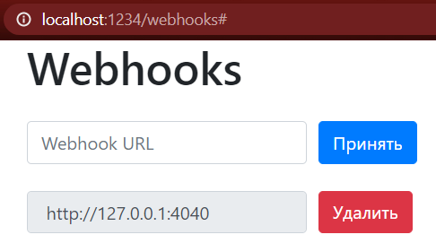
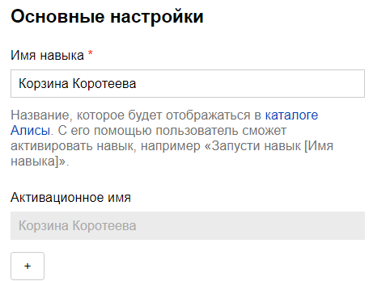
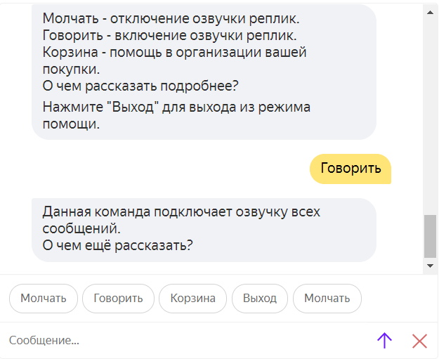
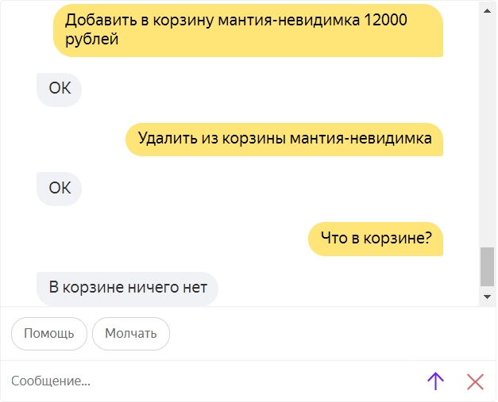
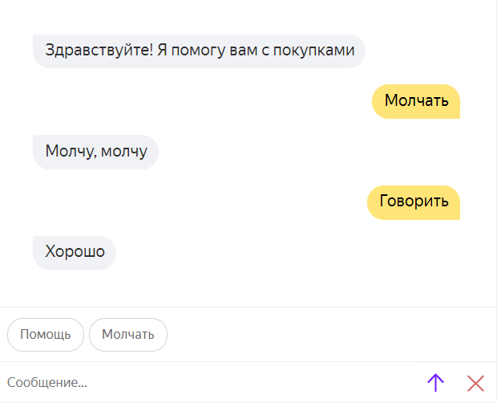

<p align="center">МИНИСТЕРСТВО НАУКИ  И ВЫСШЕГО ОБРАЗОВАНИЯ РОССИЙСКОЙ ФЕДЕРАЦИИ<br>
Федеральное государственное автономное образовательное учреждение высшего образования<br>
"КРЫМСКИЙ ФЕДЕРАЛЬНЫЙ УНИВЕРСИТЕТ им. В. И. ВЕРНАДСКОГО"<br>
ФИЗИКО-ТЕХНИЧЕСКИЙ ИНСТИТУТ<br>
Кафедра компьютерной инженерии и моделирования</p>
<br>
<h3 align="center">Отчёт по лабораторной работе № 2<br> по дисциплине "Программирование"</h3>

<br><br>

<p>студентки 1 курса группы ПИ-б-о-201(2)<br>
Коротеевой Кристины Александровны<br>
направления подготовки 09.03.04 "Программная инженерия"</p>


<br><br>
<table>
<tr><td>Научный руководитель<br> старший преподаватель кафедры<br> компьютерной инженерии и моделирования</td>
<td>(оценка)</td>
<td>Чабанов В.В.</td>
</tr>
</table>
<br><br>

<p align="center">Симферополь, 2020</p>
<hr>


## Цели работы

* Получить представления о структуре post-запроса;
* Изучить метод взаимодействия web-приложений через webhook-и;

## Постановка задачи

1. Разработайте и зарегистрируйте навык для Алисы на сервисе Яндекс.Диалоги

2. В качестве backend-a для навыка реализуйте приложение на языке С++ выполняющее следующие функции:

    1. Составление продуктовой корзины:

        * Добавление продукта в корзину;
        * Удаление продукта из корзины;
        * Очистка корзины;
        * Вывод списка товаров в корзине;
        * Подсчёт стоимости товаров в корзине.

    2. Вывод справочной информации по навыку;

    3. Регистрацию webhook-ов сторонних сервисов;

    4. Отправку данных на сторонние сервисы. 

3. В качестве стороннего сервиса реализуйте приложение на языке Python выполняющее следующие функции:

    1. Ожидание данных о покупке;
    2. Сохранение поступивших данных в excel-документ.

Подробности указаны далее.

## Выполнение работы

#### Подготовка к созданию программы, изучение материала

1. Изучаем структуру post-запросов
2. Изучаем информацию о вебхуках

#### Подготовка и создание серверного приложения

Создаём серверное приложение, генерирующее сайт с вебхуками посредством post- и get-запросов. Сервер принимает запросы, приходящие на `1234` пост и, используя шаблон, генерирует страницу с внесенными вебхуками. При получении post-запроса (он отправляется при нажатии кнопок `Принять` или `Удалить`) сервер изменяет шаблон страницы, исходя из пришедшего запроса - удаляет вебхук или добавляет новый.



*Рисунок 1. Страница с вебхуками*

#### Подготовка webhook для Алисы и регистрация навыка

1. Запускаем ngrok и по команде ngrok http 1234 получаем личную ссылку. Не закрываем ngrok до завершения работы с лабораторной.
2. Регистрируем и настраиваем навык на сервисе Яндекс.Диалоги, указываем ссылку из ngrok в подразделе Backend



*Рисунок 2. Навык для Алисы*

Далее прописываем непосредственно функционал навыка, помогающего составить список покупок. Сервер должен отвечать на POST-запросы Алисы. Данный навык имеет два режима: режим помощи и основной режим. Режим помощи выводит ссылку о функционале навыка.



*Рисунок 3. Демонстрация режима Помощь*

Основной режим изменяет содержимое корзины: добавляет/удаляет новые товары, выводит их список, рассчитывает общую сумму покупки и др.



*Рисунок 4. Демонстрация работы основного режима*

Помимо этого доступна функция, отключающая озвучку реплик Алисы.



*Рисунок 5. Демонстрация работы кнопок "Говорить"/"Молчать"*

<details>
<summary>Исходный код серверной части</summary>

```c++

```
</details>
<br>


#### Создание клиентского приложения

Создаём клиентское приложение, которое будет запускаться и ждать post-запрос к роуту `/` `1234` поста. При получении запроса данные записываются в буфер. Когда количество записей в буфере превосходит 1000, данные сохраняются таблицу data.xlsx, а буфер очищается. Если файл уже существует, то данные отправляются в конец файла.

<details>
<summary>Исходный код клиента</summary>

```python

```
</details>
<br>

[Ссылка на файл]() со списком покупок.

## Вывод

- Было получено представление о структуре post-запроса
- Был webhooks как метод взаимодействия web-приложений