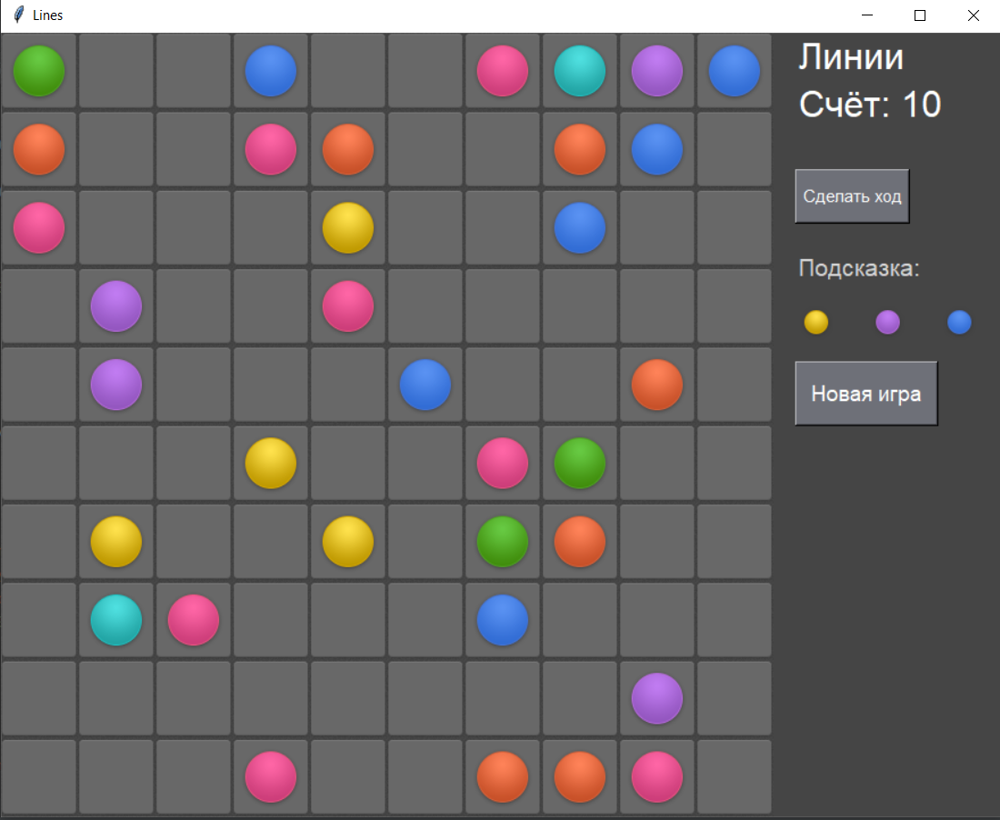

<p align="center">МИНИСТЕРСТВО НАУКИ  И ВЫСШЕГО ОБРАЗОВАНИЯ РОССИЙСКОЙ ФЕДЕРАЦИИ<br>
Федеральное государственное автономное образовательное учреждение высшего образования<br>
"КРЫМСКИЙ ФЕДЕРАЛЬНЫЙ УНИВЕРСИТЕТ им. В. И. ВЕРНАДСКОГО"<br>
ФИЗИКО-ТЕХНИЧЕСКИЙ ИНСТИТУТ<br>
Кафедра компьютерной инженерии и моделирования</p>
<br>
<h3 align="center">Отчёт по лабораторной работе № 3<br> по дисциплине "Программирование"</h3>

<br><br>

<p>студентки 1 курса группы ПИ-б-о-201(2)<br>
Коротеевой Кристины Александровны<br>
направления подготовки 09.03.04 "Программная инженерия"</p>


<br><br>
<table>
<tr><td>Научный руководитель<br> старший преподаватель кафедры<br> компьютерной инженерии и моделирования</td>
<td>(оценка)</td>
<td>Чабанов В.В.</td>
</tr>
</table>
<br><br>

<p align="center">Симферополь, 2020</p>
<hr>


## Цели работы

* Закрепить навыки разработки программ с простым графическим интерфейсом пользователя на зыке Python при помощи библиотеки Tkinter;
* Получить представление о разработке простых игровых приложений.

## Постановка задачи

1. Используя стандартный модуль для разработки программ с графическим интерфейсом Tkinter реализуйте игру Lines на зыке Python.
2. В качестве образца графического интерфейса используйте [данную игру](http://game-shariki.ru/linii-2).

Подробности указаны далее.

## Выполнение работы  

#### Подготовка к работе

1. Изучаем образец игры, представленной по [ссылке](http://game-shariki.ru/linii-2).
2. Для работы с изображениями устанавливаем библиотеку Pillow командой pip install --upgrade Pillow в cmd.

### Создание приложения

Для написания приложения использовалось ООП, и, с помощью классов были написаны две большие части кода, отвечающие за интерфейс и логику игры соответственно. 
В первой части обрезаем изображения из папки с ресурсами и для удобства создаю с ними класс, далее с помощью упаковщика grid создаем поле 9х9 ячеек, в каждую из которых располагаем соответствующие иконки, расставляем нужные строки и кнопки на панель, находящуюся по правую сторону от этого игорового поля. Помимо этого мною была предпринята попытка установки [изображения из папки с ресурсами](./resources/page-bgr.png) в качестве фона, но изображение растянулось сильнее, чем ожидалось и это портило внешний вид игры, потому было принято решение просто изменить цвет фона.
Функции, находящиеся в классах втоой части кода начинают работать при развитии одного из возможных сюжетов: нажатия на кнопку, нажатия на игровые элементы, при окончании игры. Что делать в конкретный момент игры программа понимает исходя из переменной, хранящей нынешнее состояние (self.state). Проверка собранных линий и проверка путей к определенной ячейке прописана в отдельных функциях. Также данная часть кода создает рандомные шарики и обновляет буфер с Подсказкой.

На рисунке ниже представлен графический интерфейс приложения входе игры.



*Рисунок 1. Демонстрация интерфейса приложения*

<details>
<summary>Исходный код приложения</summary>

```python
from tkinter import *
from PIL import Image, ImageTk
from os import path
from random import randint


# grafic interface part
class XY:
    def __init__(self, x: int, y: int):
        self.x = x
        self.y = y

    @staticmethod
    def minus(xy1, xy2):
        return XY(xy1.x - xy2.x, xy1.y - xy2.y)


class Tile:
    def __init__(self, name, size):
        img_folder = path.realpath(path.dirname(__file__) + '/resources')
        self.__image_path = img_folder + f'/{name}.png'
        self.normal
        self.size = size
        self.buffer = [None for i in range(10)]

    @property
    def rgba(self):
        self.image = Image.open(self.__image_path).convert('RGBA')
        return self

    @property
    def normal(self):
        self.image = Image.open(self.__image_path)
        return self

    def photo_image(self, i):
        if not self.buffer[i]:
            taken = self.crop(i)
            taken_photo = ImageTk.PhotoImage(taken)
            self.buffer[i] = taken_photo
            return taken_photo

        else:
            return self.buffer[i]

    def crop(self, i):
        step = self.size
        xs = 1
        xe = self.size
        ys = (i - 1) * step
        ye = i * step
        taken = self.image.crop((xs, ys, xe, ye))

        return taken


class UITiles():
    def __init__(self):
        self.aqua = Tile('ball-aqua', 60)
        self.blue = Tile('ball-blue', 60)
        self.green = Tile('ball-green', 60)
        self.pink = Tile('ball-pink', 60)
        self.red = Tile('ball-red', 60)
        self.violet = Tile('ball-violet', 60)
        self.yellow = Tile('ball-yellow', 60)

        self.bg_cell = Tile('cell-bgr', 69)
        self.bg_page = Tile('page-bgr', 128)


tiles = None


class UICell(Label):
    def __init__(self, master, row, col, field):
        self.mixed = None
        self.ball_tile = None
        self.field: list[list[UICell]] = field

        super().__init__(master, image=tiles.bg_cell.photo_image(1), borderwidth=0)
        self.grid(row=row, column=col)
        self.bind('<Button-1>', self.on_click)
        self.on_click_handler = None
        self.pos = XY(col, row)
        self.is_prev = False  # for waterfall algor

    def set_ball(self, ball_tile: Tile):
        self.__mix_bg_with_ball(1, ball_tile, 1)

    def focus(self):
        self.__mix_bg_with_ball(2, self.ball_tile, 1)

    def blur(self):
        self.__mix_bg_with_ball(1, self.ball_tile, 1)

    def __mix_bg_with_ball(self, bg_tile_num, ball_tile, ball_tile_num):
        bg = tiles.bg_cell.rgba.crop(bg_tile_num)
        ball = ball_tile.rgba.crop(ball_tile_num)
        ball_new = Image.new('RGBA', bg.size)
        ball_new.paste(ball, (7, 6))
        baked = Image.alpha_composite(bg, ball_new)
        baked_photo = ImageTk.PhotoImage(baked)
        self.mixed = baked_photo
        self.ball_tile = ball_tile
        self.config(image=baked_photo)

    def free_up(self):
        self.mixed = None
        self.config(image=tiles.bg_cell.photo_image(1))

    def on_click(self, event):
        if self.on_click_handler:
            self.on_click_handler(self, event)

    @property
    def is_free(self):
        return not self.mixed

    def get_sibling(self, direction: XY):
        rev_dir = XY(-direction.x, -direction.y)
        sibling_xy = XY.minus(self.pos, rev_dir)
        if sibling_xy.x < 0 or sibling_xy.y < 0 or sibling_xy.y > len(self.field) - 1 or sibling_xy.x > len(self.field[0]) - 1 :
            return None
        return self.field[sibling_xy.y][sibling_xy.x]


class UIPanelAbout():
    def __init__(self, master):
        self.lines = Label(master, font=("italic", 24), bg='#454545', fg='white')
        self.lines.grid(row=1, column=1, columnspan=3, sticky=W, padx=10)
        self.score = Label(master, font=("italic", 24), bg='#454545', fg='white')
        self.score.grid(row=2, column=1, columnspan=3, sticky=W, padx=10)
        self.set_lines(0)
        self.set_score(0)
        Label(master, height=2, bg='#454545').grid(row=3, column=1, columnspan=3)

    def set_lines(self, value):
        self.lines.config(text=f'Линии')

    def set_score(self, value):
        self.score.config(text=f'Счёт: {value}')


class UIStepButton():
    def __init__(self, master):
        self.step = Button(master, relief='raised', text="Сделать ход", font=("italic", 11),  bg='#6e7078', fg='white',
                            padx=15, pady=10, width=7, height=1)
        self.step.grid(row=4, column=1, columnspan=3, sticky=W, padx=10)
        Label(master, height=1, bg='#454545').grid(row=5, column=1, columnspan=3)


class UIPromptPanel(list):
    def __init__(self, master):
        super().__init__()
        Label(master, height=2, background='#454545').grid(row=6, column=1, columnspan=3)
        Label(master, text='Подсказка:', font=("italic", 16), bg='#454545', fg='light gray').grid(row=6, column=1, columnspan=3, sticky=W, padx=10)
        self.model = []
        for i in range(3):
            self.append(Label(master, bg='#454545'))
            self.model.append(None)
            self[i].grid(row=7, column=1 + i)
        Label(master, height=3, bg='#454545').grid(row=10, column=1, columnspan=3)

    def update(self: list, three_balls: list):
        i = 0
        for ball in three_balls:
            self[i].config(image=ball.photo_image(5))
            self.model[i] = ball
            i += 1


class UINewGameButton():
    def __init__(self, master):
        self.new = Button(master, relief='raised', text="Новая игра", font=("italic", 14), bg='#6e7078', fg='white', padx=15, pady=10, width=8)
        self.new.grid(row=9, column=1, columnspan=3, sticky=W, padx=10)


class UIPanel():
    def __init__(self, master):
        master.config(bg='#454545', padx=9)
        self.about = UIPanelAbout(master)
        self.do_step = UIStepButton(master)
        self.tip = UIPromptPanel(master)
        self.new_game = UINewGameButton(master)


class UI():
    def __init__(self):
        global tiles

        n = 10
        panel_width = 200
        cell_size = 68
        width = cell_size * n + panel_width
        height = cell_size * n + 10
        bg_color = '#454545'

        self.root = Tk()
        self.root.title("Lines")
        self.root["bg"] = bg_color
        self.size = XY(width, height)
        self.root.geometry(str(width) + 'x' + str(height))

        tiles = UITiles()
        self.tiles = tiles

        self.field_frame = Frame(self.root)
        self.field_frame.grid(row=1, column=1)

        self.panel_frame = Frame(self.root, width=panel_width)
        self.panel_frame.grid(row=1, column=2, sticky=N)
        self.panel = UIPanel(self.panel_frame)

        self.field = []
        for row in range(n):
            self.field.append([])
            for col in range(n):
                cell = UICell(self.field_frame, row, col, self.field)
                self.field[row].append(cell)

        self.game_over = Label(self.panel_frame, text="Всё, проиграли!", fg='white', bg=bg_color, font=('italic', 12))

    @property
    def game_over_is_in_view(self):
        pass

    @game_over_is_in_view.setter
    def game_over_is_in_view(self, visible: bool):
        if visible:
            self.game_over.grid(row=10, column=1, columnspan=3, sticky=W, padx=10)
        else:
            self.game_over.place_forget()

    def loop(self):
        self.root.mainloop()


# logic part
class LogicField(list):
    def __init__(self, field: list):
        self.field = field

        size = len(field)

        def get_square_diagonal(shift_x, shift_y, square_size, reversed=False):
            nonlocal field

            diag = []
            for i in range(square_size):  # main main diag
                if not reversed:
                    zx = i
                    zy = i
                else:
                    zx = square_size - 1 - i
                    zy = i
                diag.append(field[shift_y + zy][shift_x + zx])

            return diag

        rows = field

        cols = [[] for cell in field[0]]
        for row in field:
            i = 0
            for cell in row:
                cols[i].append(cell)
                i += 1

        normal_diags = []
        normal_diags.append(get_square_diagonal(0, 0, size))
        for i in range(5, size):  # paired main diags
            k = size - i
            normal_diags.append(get_square_diagonal(k, 0, i))
            normal_diags.append(get_square_diagonal(0, k, i))

        reversed_diags = []
        reversed_diags.append(get_square_diagonal(0, 0, size, True))
        for i in range(5, size):  # paired sub diags
            k = size - i
            reversed_diags.append(get_square_diagonal(k, k, i, True))
            reversed_diags.append(get_square_diagonal(0, 0, i, True))

        self.rows = rows
        self.cols = cols
        self.normal_diags = normal_diags
        self.reversed_diags = reversed_diags


class Logic:
    def __init__(self, ui: UI):
        self.ui = ui
        self.state = 'Шарик не выбран'

        self.focused = None

        self.score = 0
        self.lines = 0

        self.field = LogicField(ui.field)

        self.restart()

        ui.panel.do_step.step.bind('<Button-1>', self.step)
        ui.panel.new_game.new.bind('<Button-1>', self.restart)

        for row in self.ui.field:
            for cell in row:
                cell.on_click_handler = self.__cell_click_handler

    def restart(self, event=None):
        self.ui.game_over_is_in_view = False
        self.__free_up_all()

        self.gen_tip()
        self.step()

        self.ui.panel.about.set_score(0)
        self.score = 0
        self.ui.panel.about.set_lines(0)
        self.lines = 0

        self.state = 'Шарик не выбран'

    def step(self, event=None):
        self.use_tip()
        self.gen_tip()

    def gen_tip(self):
        balls = []
        for i in range(3):
            balls.append(self.__rand_ball())
        self.ui.panel.tip.update(balls)

    def use_tip(self):
        tip = self.ui.panel.tip

        free = self.__get_free_cells()

        for i in range(2, -1, -1):
            if len(free) - i <= 1:  # if free cells less then tip count
                self.state = 'Завершение игры'
                self.game_over()
                return
            else:
                cell = self.__rand_el(free)
                cell.set_ball(tip.model[i])
                free.pop()

    def game_over(self):
        self.ui.game_over_is_in_view = True
        self.state = 'Всё, проиграли!'

    def __rand_el(self, list_of):
        return list_of[randint(0, len(list_of) - 1)]

    def __rand_ball(self):
        tiles = self.ui.tiles
        balls = [
            tiles.aqua,
            tiles.blue,
            tiles.green,
            tiles.pink,
            tiles.red,
            tiles.violet,
            tiles.yellow
        ]

        return self.__rand_el(balls)

    def __get_free_cells(self):
        free = []
        field = self.ui.field
        for row in field:
            for cell in row:
                if cell.is_free:
                    free.append(cell)
        return free

    def __free_up_all(self):
        field = self.ui.field

        for row in field:
            for cell in row:
                cell.free_up()

    def __cell_click_handler(self, cell: UICell, event):
        if cell.is_free:
            # free cell
            if self.state == 'Шарик не выбран':
                pass
            elif self.state == 'Шарик выбран':
                reachable = self.__cells_reachable(self.focused, cell)

                if reachable:  # cell is reachable
                    cell.set_ball(self.focused.ball_tile)

                    self.focused.blur()
                    self.focused.free_up()
                    self.focused = None

                    self.state = 'Шарик перемещён'

                    lines = self.__find_all_lines()

                    for line in lines:
                        self.lines += 1
                        self.ui.panel.about.set_lines(self.lines)

                        for cell in line:
                            cell.blur()
                            cell.free_up()

                            self.score += 2
                            self.ui.panel.about.set_score(self.score)

                    self.state = 'Шарик не выбран'

                    if len(lines) == 0:
                        self.step()
                else:  # cell is unreachable
                    pass
        else:
            # ball
            if self.state == 'Шарик не выбран':
                self.state = 'Шарик выбран'
                self.focused = cell
                cell.focus()
            elif self.state == 'Шарик выбран':
                self.focused.blur()
                self.focused = cell
                cell.focus()

    def __cells_reachable(self, a: UICell, b: UICell):

        def cells_unset_prev():
            field = self.ui.field
            for row in field:
                for cell in row:
                    cell.is_prev = False

        def step_four_sides(from_cell: UICell, target: UICell):
            steps = []

            left = XY(1, 0)
            right = XY(-1, 0)
            up = XY(0, 1)
            down = XY(0, -1)
            for direction in [up, down, left, right]:
                sibling = from_cell.get_sibling(direction)

                if not sibling:
                    continue

                if sibling == target:
                    return True
                else:
                    if sibling.is_free and not sibling.is_prev:
                        sibling.is_prev = True
                        steps.append(sibling)

                    elif sibling.is_free and sibling.is_prev:
                        pass

                    elif not sibling.is_free:
                        pass

            return steps

        steps = [a]

        while True:
            new_steps_storage = []

            for step in steps:
                new_steps = step_four_sides(step, b)

                if new_steps is True:  # found
                    cells_unset_prev()
                    return True
                else:  # steps made
                    new_steps_storage += new_steps

            if len(new_steps_storage) == 0:  # no new steps
                cells_unset_prev()
                return False
            steps = new_steps_storage

    def __find_all_lines(self):

        def get_sequences(lines):
            sequences = []

            for line in lines:
                sequence = []
                prev_color = None

                def reset_sequence(color, cell=None):
                    nonlocal sequence, prev_color

                    if len(sequence) > 4:
                        sequence = sequence[-5:]
                        sequences.append(sequence)

                    prev_color = color
                    sequence = [cell] if cell else []

                for cell in line:
                    if cell.is_free:
                        reset_sequence(None)
                        continue

                    else:
                        curr_color = cell.ball_tile

                        if prev_color is None:
                            reset_sequence(curr_color, cell)

                        elif curr_color == prev_color:
                            sequence.append(cell)

                        else:  # prev_color and curr_color != prev_color
                            reset_sequence(curr_color, cell)

                reset_sequence(None)

            return sequences

        lines = []
        lines.extend(get_sequences(self.field.rows))
        lines.extend(get_sequences(self.field.cols))
        lines.extend(get_sequences(self.field.normal_diags))
        lines.extend(get_sequences(self.field.reversed_diags))

        return lines


#   Main part
ui = UI()
logic = Logic(ui)
ui.loop()

```
</details>
<br>

Код также представлен по [ссылке](./lines.py)


## Вывод

В ходе работы были закреплены навыки разработки программ с простым графическим интерфейсом пользователя на зыке Python при помощи библиотеки Tkinter, получено представление о разработке простых игровых приложений.