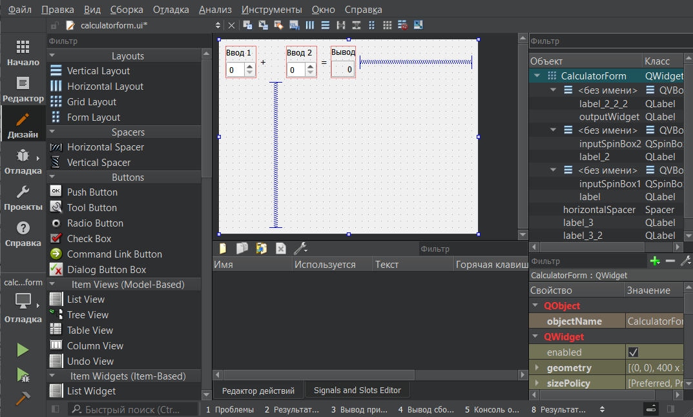

<p align="center">МИНИСТЕРСТВО НАУКИ  И ВЫСШЕГО ОБРАЗОВАНИЯ РОССИЙСКОЙ ФЕДЕРАЦИИ<br>
Федеральное государственное автономное образовательное учреждение высшего образования<br>
"КРЫМСКИЙ ФЕДЕРАЛЬНЫЙ УНИВЕРСИТЕТ им. В. И. ВЕРНАДСКОГО"<br>
ФИЗИКО-ТЕХНИЧЕСКИЙ ИНСТИТУТ<br>
Кафедра компьютерной инженерии и моделирования</p>
<br>
<h3 align="center">Отчёт по лабораторной работе № 4<br> по дисциплине "Программирование"</h3>

<br><br>

<p>студента 1 курса группы ПИ-б-о-201(2)<br>
Коротеевой Кристины Александровны<br>
направления подготовки 09.03.04 "Программная инженерия"</p>


<br><br>
<table>
<tr><td>Научный руководитель<br> старший преподаватель кафедры<br> компьютерной инженерии и моделирования</td>
<td>(оценка)</td>
<td>Чабанов В.В.</td>
</tr>
</table>
<br><br>

<p align="center">Симферополь, 2021</p>
<hr>


## Цели работы

1. Установить фреймворк Qt;
2. Изучить основные возможности создания и отладки программ в IDE Qt Creator.

## Постановка задачи

Настроить рабочее окружение, для разработки программного обеспечения при помощи Qt и IDE Qt Creator, а также изучить базовые возможности данного фреймворка.

## Выполнение работы  


#### Задание 1. Установка

Скачиваем и устанавливаем стабильную версию фреймворка Qt, выбрав компоненты Qt для сборки при помощи MinGW. Чтобы убедиться, что установка прошла успешно, запускаем Qt Creator и в разделе Примеры выбираем проект Calculator Form Example под Desktop. Далее в Редакторе свойств заменяем текст "Input 1", "Input 2", "Output" на "Ввод 1", "Ввод 2" и "Вывод" соответственно. 



*Рисунок 1. Демонстрация приложения*

#### Задание 2. Ответы на вопросы

1. Как изменить цветовую схему (оформление) среды?

Темы можно выбрать через меню "Инструменты > Параметры... > Среда > Интерфейс > Тема". 

2. Как закомментировать/раскомментировать блок кода средствами Qt Creator? Имеется ввиду комбинация клавиш или пункт меню.

Чтобы закомментировать/расскомментировать выделенный код используется комбинация клавиш Ctrl+/.

3. Как открыть в проводнике Windows папку с проектом средствами Qt Creator?

"Файл > Открыть файл или проект"

4. Какое расширение файла-проекта используется Qt Creator? Может быть несколько ответов.

<имя проекта>.pro 

5. Как запустить код без отладки?

Три варианта запуска: использование комбинации клавиш Ctrl+R, запуск через меню "Сборка > Запустить", запуск с помощью зеленого треугольника в левой панели.

6. Как запустить код в режиме отладки?

С помощью зеленой кнопки с жучком в левой панели, либо через меню: "Отладка > Начать отладку"

7. Как установить/убрать точку останова (breakpoint)?

Через меню: "Отладка > Поставить/снять точку останова", либо нажать на область слева от номера нужной строки.

#### Задание 3. Создание первого консольного приложения
1. Создаём консольное приложение без Qt на языке С++ и заменяем его содержисое на следующий код:

```C++
#include <iostream>
 
int main() {
    int i;
    double d;
    i = 5;
    d = 5;
    std::cout << i << d;
}
```
<br> 
2. Переключаем режим сборки в режим Отладка и ставим точки останова на строки 6, 7 и 8. Выполняем программу в режиме отладки.

* Значения  переменных i и d в 6 строке:
```C++
d = 7.4827072092941802e-317
i = 0
```

* Значения  переменных i и d в 7 строке:
```C++
d = 7.4827072092941802e-317
i = 5
```

* Значения  переменных i и d в 8 строке:
```C++
d = 5
i = 5
```

#### Задание 4. Обновление .gitignore
Добавляем данные из файла Qt.gitignore, расположенного на [github](https://github.com/github/gitignore), в конец уже имеющегося в репозитории файла .gitignore.


## Вывод

В ходе работы были получены и закреплены навыки работы с фреймворком Qt, а также навыки установки и настройки данной среды разработки.